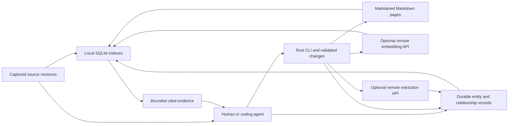

# Architecture proposal

Status: proposed, 2026-09-28. See [confirmed choices and progress](../PROGRESS.md). Examples describe future behavior, not an existing CLI.

## Product boundary

Build a durable knowledge tool with three entry points: a human at a terminal, an agent calling structured commands, and eventually a bounded research runner. The same storage and mutation rules apply to all three.

The product captures sources, maintains linked Markdown pages and an extracted entity/relationship graph, finds evidence, assembles bounded context, and explains where a statement came from. Local storage, indexing, lexical retrieval, and traversal of an existing graph work without model calls. Extraction and new synthesis use an existing agent or a configured generation API; the CLI validates and stores their results.

The recommended first integration is an existing coding agent plus the CLI and a usage skill, including graph extraction. Direct API extraction follows alongside semantic search, before the full standalone research runner. An embeddings endpoint provides vectors; extracting entities and relationships requires a separate generation capability.

User decisions: include a LightRAG-inspired entity/relationship graph; keep as much durable state as practical in Obsidian-compatible Markdown; and use remote `/v1/embeddings`-compatible APIs for semantic search. There is no local inference runtime in the design. Lexical graph lookup and traversal remain offline; extraction and semantic graph seeding may require remote calls. See [the Markdown format](wiki-format.md), [embedding configuration](embeddings.md), and [the graph design](knowledge-graph.md).



## Storage ownership

Use a normal directory that can be opened in an editor or Obsidian and optionally tracked in Git:

```text
my-wiki/
  WIKI.md                         # format, vault identity, conventions, profile names
  index.md                        # generated navigation; curated prose elsewhere
  pages/                          # durable Markdown knowledge
  knowledge/
    entities/<id>.md              # entity identity, aliases, readable description
    assertions/<id>.md            # typed relationships and qualifiers
    evidence/<id>.md              # assertion/source revision/span support
    extractions/<job-id>.md       # preserved output and source mapping
    decisions/<id>.md             # durable merge/split/rejection decisions
  sources/<source-id>/
    source.md                     # URL, title, revision manifest, retrieval dates
    revisions/<revision>/
      original.*                  # captured bytes when available
      content.md                  # normalized readable extraction
      revision.md                 # extractor version, input/output hashes
  runs/<run-id>/
    run.md                        # scope, checkpoint, pending work
    events/<event-id>.md          # completed events and cost receipts
    report.md
  changes/<change-id>/
    change.md                     # staged changes, hashes, outcome
    proposed/*.md                 # proposed content or reconstructable patches
    before/*.md                   # prior content for recovery
    assets/                       # any referenced binary payloads
  .wiki/
    cache/index.sqlite            # rebuildable lexical/graph/vector projections
    state/                        # locks and operational coordination
    local.toml                    # ignored overrides; no default secret storage
```

**Sources, maintained pages, and graph records are durable.** Pages and graph records contain editorial decisions, identities, relationships, and extraction work that cannot be faithfully recreated by rerunning an LLM. Back them up, plus run receipts and unapplied changes. Only the search database and generated navigation are reconstructable projections. Embeddings are derived too, but re-creating them can cost money; optional cache backups are useful.

Keep source snapshots immutable. A refresh adds a revision and advances a manifest pointer. Preserve the observed URL, retrieval time, publication date when known, content hash, and extraction version separately. A search result snippet is not a captured full source. An imported report from another agent records that agent/report as its origin until its underlying references have been checked.

One SQLite search file is sufficient initially. Rebuild must not erase recorded research spending, pending changes, or source identities. Transient locks and crash-recovery journals remain operational state outside the cache; private provider profiles/credentials remain outside the portable Markdown format. A Markdown-only backup preserves completed knowledge, not necessarily an in-flight response or unrecorded bill. WAL and other database sidecars are local operational files, not files to Git-sync between machines. Git is optional and never a prerequisite for ordinary commands.

## Page and evidence format

Keep frontmatter small and preserve unknown fields:

```yaml
---
wiki_schema: "1"
wiki_id: page_01example
wiki_kind: page
title: Retrieval architecture
aliases: [Search architecture]
tags: [retrieval, design]
wiki_status: reviewed
---
```

Use readable relative Markdown links by default. Parse Obsidian wikilinks, aliases, and heading references as an import/interoperability feature. Ambiguous names produce diagnostics rather than arbitrary links. Ignore apparent links inside code blocks. Filename renames do not change an explicit page ID; managed rename updates incoming links.

Evidence references identify source ID, immutable source revision, heading or passage locator, and quote/text hash. Source line numbers are useful display locations but cannot be durable identity. A page may cite another page for navigation; factual support should remain traceable to the underlying source.

Use paragraph-level page citations and per-assertion evidence for extracted relationships; not every prose sentence needs a claim record. Explicit relations such as `supersedes`, `contradicts`, and `depends_on` belong in readable frontmatter or referenced records, with provenance. Entity assertions retain direction, qualifiers, source revision/spans, and extraction status. Never infer that two similarly named entities are identical solely from their names.

Pages imported without IDs remain searchable without rewriting their content. Use path-based provisional identities until an explicit adoption operation adds durable frontmatter IDs. Detect duplicate explicit IDs; do not silently merge them. A heading/title change preserves identity. Invalid or deleted metadata gets a diagnostic and best-effort repair; arbitrary deleted IDs are not recoverable by promise. Typed references retain IDs plus readable links, and evidence uses source revisions and quote/span hashes rather than mutable headings.

## Embedded index

Initial logical tables:

| Projection | Contents |
|---|---|
| `documents` | ID, kind, path, title, aliases, content hash, source revision |
| `documents_fts` | FTS5 title, headings, aliases, and body; document-level field-weighted ranking |
| `retrieval_units` | Optional derived sections/windows: document ID, revision, display heading, byte/line span, input hash |
| `links` | Source/target IDs, link kind, source location, resolution status |
| `citations` | Page/passage to immutable source revision and locator |
| `entities`, `entity_aliases` | Stable entity IDs, types, descriptions, aliases, resolution decisions |
| `assertions`, `assertion_evidence` | Subject, predicate, object, qualifiers, support/contradiction, source spans, status |
| `graph_fts` | Entity names/descriptions and relationship text for offline seed retrieval |
| `embedding_spaces` | Profile fingerprint, model/revision, dimension, formatting and normalization |
| `embeddings` | Target kind/ID (document, derived unit, entity, or relationship), space ID, float vector, actual input hash, receipt reference |
| `index_meta` | Schema, parser/chunker versions, generation and last complete sync |

Store document text locally so ranking and excerpts can be served consistently; add derived passages when needed. Scan metadata and hash changed files on sync; a filesystem watcher is optional later. A full verification scan must detect same-size/same-timestamp edits that a fast metadata scan could miss. Deletion removes projections without silently erasing editorial history.

Persist source withdrawal and dependency-review status in durable records. Exclude withdrawn sources and derived passages that have lost their support from current-evidence results; retain explicitly labeled historical access. With paragraph-level citations, conservatively invalidate the affected paragraph or section, or the whole page when support is only page-level. A changed source revision triggers review rather than automatically proving the old claim false. Withdrawal is distinct from an explicitly requested content purge.

Keep short notes as whole retrieval/embedding inputs. Longer inputs split only for provider limits or a measured/configured retrieval-quality need, using headings and paragraphs as preferred boundaries. Corpus file count alone does not determine this. Bounded extraction windows may also be necessary without embeddings. All such units are derived index records; no user-managed chunk files or permanent heading-based IDs are required. Cache actual formatted input by embedding-space fingerprint and text hash. See [segmentation and heading repair](wiki-format.md).

## Retrieval paths

| Mode | Behavior | Network |
|---|---|---|
| Literal | Exact substring/regex search directly over allowed files | None |
| Lexical | Ranked document retrieval using FTS5, title/alias lookup, and focused excerpts | None |
| Graph | Page/provenance traversal plus entity- or relationship-focused retrieval | None with lexical seeds; query embedding with semantic seeds |
| Semantic | Query embedding API call, local vector comparison | On cache miss |
| Hybrid | Lexical + semantic candidates, rank fusion, selected entity/relationship evidence and source chunks | On query-vector cache miss |

The default search mode is lexical, even when embeddings are configured. `--mode semantic` and `--mode hybrid` make the remote work explicit. A configured policy may choose otherwise, but the output must identify the actual mode and any fallback. `--offline` forbids all network requests and credential commands. Semantic queries may work from a matching query-vector cache; otherwise they return a clear unavailable result. Optional fallback to lexical is explicit, never disguised as semantic success.

Run a bounded incremental sync before indexed search by default; allow `--no-sync` and report freshness. Metadata scanning is an optimization, not proof that every file is unchanged. Read one published SQLite generation, and rehash both final passage files and relevant source-status, evidence, assertion, and decision records. Reconcile or discard candidates whose dependencies changed. Results identify the verified source/graph snapshot and verification time; external edits after that check are outside the snapshot guarantee. Explicit snapshot mode labels unverified index results. Index refresh never calls extraction or embedding models automatically. Changed documents remain lexically searchable while extraction/semantic coverage is incomplete. Report pending extraction and embedded/eligible counts and exclude stale assertions/vectors from current evidence.

Start semantic search with exact cosine retrieval over normalized float vectors stored in SQLite. A feasibility spike chooses between a Rust scan and a pinned stable SQLite vector extension; neither requires a server. Benchmark ANN only if measured latency and corpus size require it. A vector index is separate from the API that generates vectors.

Use rank-based fusion, then deduplicate overlapping passages and diversify by document. Graph neighbors have an explicit depth, edge-type filter, and candidate cap; highly connected entities must not swallow the context budget. Do not combine raw BM25 and cosine scores as though their units match. Entity/relationship retrieval is planned functionality; learned reranking and community summaries remain later experiments. [Retrieval evidence and alternatives](research/retrieval.md).

## Extracted entity/relationship graph

The graph captures assertions such as an organization maintaining a project or a system depending on a component. Entity, assertion, and evidence notes carry flat frontmatter and visible Markdown links. They appear as linked note nodes in Obsidian; the CLI additionally interprets typed assertions. Preserve entity mentions and candidate identities, relation direction and qualifiers, and evidence passages rather than reducing every relationship to a bare pair of names. Name-only matches and model confidence are insufficient proof of identity or truth. Contradictory assertions can coexist with distinct sources and time scopes.

Extraction is an explicit, bounded job. Initially the CLI exports an extraction packet for the host agent and validates its returned structured records. A direct generation API later performs the same job through the CLI. The API configuration uses a separate model and full URL with static or dynamic credentials under the same endpoint-trust rules as embeddings; the generation request/response adapter is a separate contract. No local model or Python LightRAG runtime is required.

Cache completed extraction by actual input and extractor configuration; reprocess changed inputs only. Persist identity corrections and rejection decisions separately so later extraction cannot silently undo them. Source withdrawal removes its support, invalidates affected aggregates, and deactivates assertions without valid support. SQLite rebuilds replay these durable records without LLM calls.

Provide entity-focused retrieval, relationship/topic-focused retrieval, and combined retrieval with original source chunks. These are a LightRAG-inspired Rust design, not a claim of exact upstream algorithm parity. Lexical seeds permit offline graph queries; semantic seeds and optional LLM query-keyword extraction are explicit remote operations. Return traversed paths and supporting source spans, with graph coverage and truncation metadata. See [the detailed graph contract](knowledge-graph.md).

`context` returns a bounded evidence bundle with page/source IDs, revisions, excerpts, retrieval reasons, and omissions. Prefer source and reviewed-page evidence; expose origin/status filters. Token counts are exact only with a matching tokenizer; otherwise label estimates and enforce an additional byte ceiling. Preserve enough evidence for an agent to inspect the original passage without rereading the entire vault.

## Human and agent command contract

Proposed examples:

```sh
lwiki init ./my-wiki
cd ./my-wiki
lwiki source add ../article.md
lwiki index sync
lwiki search 'credential rotation' --mode lexical
lwiki search 'short-lived API tokens' --mode hybrid --json
lwiki graph neighbors page_01example --depth 1 --json
lwiki graph query 'Which projects depend on SQLite?' --strategy combined --seed lexical --json
lwiki context 'embedding credentials' --max-tokens 3000 --json
lwiki check
lwiki doctor
```

Humans get concise results with paths, headings, matching excerpts, and next actions. An explicit `--json` returns a versioned envelope with data, warnings, freshness, and structured errors; stdout contains only that response. Progress goes to stderr. Long-running work can opt into versioned JSONL events. No interactive prompt is required when all inputs are supplied.

Add `--wiki PATH`, stdin/file inputs for bulk text, deterministic ordering and tie-breaking, pagination, exit-code documentation, and a capability/schema command. Avoid secrets in CLI arguments. Empty search results are successful queries with zero matches; invalid arguments, conflicts, and failed operations have distinct error codes.

Machine-friendly writes use `page put --file ... --if-match <content-hash>` and changesets. The human shortcut can open an editor using an argument-safe process launcher. Export JSON/DOT/Mermaid for graphs before building a TUI or web interface.

## Writes, conflicts, and recovery

An OS lock serializes cooperating CLI writers; expected-content hashes detect observed human/editor changes. A non-cooperating editor can still write between the final check and replacement: ordinary filesystem APIs do not provide universal content-based compare-and-swap. Retain recoverable before-images and document this remaining race. Write and validate temporary files on the same filesystem, persist a change manifest, then atomically replace individual files. A group of filesystem replacements and SQLite commits is **not** one atomic transaction.

For multi-page updates, use a recoverable journal with before/after hashes and operation status. On failure or restart, finish or reconcile the interrupted changeset, then rebuild projections. External editors can bypass locks, so recovery must preserve unfamiliar content and surface a conflict. Read-side commands detect incomplete transactions. Fault-injection tests, especially on Windows, are required before promising safe multi-file apply.

Routine, explicitly requested single-file edits need no ceremonial approval. Automated research initially creates a draft changeset and can apply it when the caller explicitly selects apply behavior. Refuse detected content conflicts, keep recovery images, preserve source snapshots, and never run generated shell commands. Validate paths remain inside the selected vault and define symlink behavior explicitly. Keep retrieved text outside the instruction/configuration trust boundary.

## First release and later extensions

The first agent-usable release ships capture, read/write, literal/lexical search, page links, durable entities/assertions, agent-assisted extraction, graph queries, context export, validation, recovery, and the skill. The next milestone adds direct API extraction and remote semantic/hybrid graph-and-chunk retrieval; the standalone research runner builds on those capabilities.

Defer community-summary GraphRAG, aggressive automatic entity merging, a resident scheduler, multi-user ACLs, OCR/browser automation, hosted services, and a custom plugin runtime. Conservative identity resolution and explicit merge/split decisions are part of the graph foundation. Text/Markdown capture is the first supported import format. Bounded URL fetching and basic HTML/text normalization arrive with standalone web research; PDF/OCR/browser extraction remains an explicit later capability.
