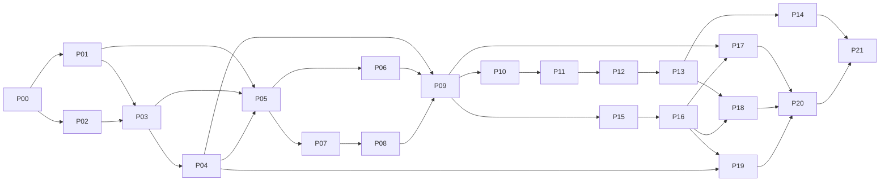

# M0–M4 implementation work packages

Historical M0–M4 package plan. For current behavior and new work use [the current contract map](../current-contracts.md); local `STATE.md` is read when present and reconstructed on a fresh checkout using the [playbook](README.md).

Detailed session reports, machine checks and `.artifacts` paths mentioned below are optional local evidence; fresh clones contain the curated summaries and tracked reproduction scripts. Recorded checks describe the identified historical source, not a new verification of the current checkout.

Status: execution plan, not implemented behavior or passing test evidence. The [technical baseline](../technical/README.md) and [implementation handoff](../technical/implementation-handoff.md) remain authoritative. M5 extensions are out of scope. Package IDs are permanent; splitting a package creates suffixes such as `P16.a`, never renumbers later work.

The orchestrator is `gpt-6-sol`. Leaf implementation uses `gpt-6-sol`; `gpt-6-astra` reviews the difficult storage, evidence, identity, accounting, and network invariants identified below. The orchestrator integrates, validates, updates STATE.md (optional local `STATE.md`), and records evidence against [VALIDATION.md](VALIDATION.md). A package is complete only when its code, named local tests, review findings, and integration evidence meet its done criteria. Planning text does not pass a gate.

Reviewer labels identify the needed expertise, not a demand for redundant full reviews. Combine bounded gate reviews where appropriate: P01/P02; P03/P05/P09 with prerequisite-specific findings resolved before dependents proceed; P11–P13; P15/P16; P17–P20; and the final integrated exit. Review the newly changed invariant and its evidence, reusing accepted earlier findings. The [execution playbook](README.md) controls model fallback and disclosure; substitution preserves every gate.

## Ownership and bounded task packets

Every task packet includes its package ID, predecessor state, permitted paths, required reads, accepted interfaces, deliverables, named tests, and done criteria. Read the baseline and handoff once; subsequent tasks receive their relevant excerpts and links rather than the full repository history. Required technical reads below name exact sections; read those sections in full. Read the package's current state and relevant validation rows before starting. Additional investigation is allowed when a concrete failure requires it, with the reason recorded.

`Cargo.toml`, `Cargo.lock`, `src/lib.rs`, `src/main.rs`, module root/export files, the CLI command registry, and public schema files/registries are root-owned integration surfaces. Leaf agents propose precise deltas for them; only the orchestrator applies those deltas, sequentially. P00 bootstraps those surfaces as an orchestrator task. Leaf ownership of a module means its package-specific implementation files, not permission to edit shared exports. The same rule applies to fixture manifests shared between packages.

The orchestrator owns this playbook, execution state, decisions, prompts, and validation documents. A leaf reports its result without editing them. Separate file ownership permits parallel work; dependency or shared-file integration happens sequentially. If a packet would require two agents to edit one file, split it into narrow suffix packets and integrate each before the next writer starts. A failed prerequisite stops its dependents, while independent ready work can proceed.

Default to one library and thin `lwiki` binary, current macOS qualification first, host-driven M2 before standalone M4, strict local invariants, and reversible explicit changesets. Resolve routine naming and adapter choices in the decisions record without asking the user. Dependency/toolchain choices require actual upstream/license/linkage verification during P00; use the handoff's candidates, not guessed versions or an invented MSRV.

Tests below are proposed test names and acceptance obligations, not claims that files already exist. Their invariant names map to the canonical `Vxx` rows in [VALIDATION.md](VALIDATION.md) through the table below; that document controls evidence and status. Every package runs formatting, relevant tests, and applicable lint/build checks on the integrated revision. Final local qualification runs the complete required suite.

## Dependency graph and integration waves

| Wave | Ready work after prerequisites pass | Root integration/exit condition |
|---|---|---|
| 0 / M0 | P00 | Cargo/schema/type/fixture bootstrap compiles and rejects malformed contracts |
| 1 / M0 | P01 and P02 | Lossless adapter and current-platform replacement/lock spikes pass |
| 2 / M0–M1 | P03, then P04, then P05 | Recovery precedes managed mutation; SQLite FTS publication spike passes |
| 3 / M1 | P06 and P07; then P08 and P09 | Complete offline fixture workflow and verified context pass |
| 4 / M2 | P10 → P11 → P12 → P13 → P14 | Full graph workflow materializes each stage; exported skill examples run |
| 5 / M3 foundation | P15 may start after P09; P16 waits for P15 | No transport capability becomes callable before accounting/replay gates |
| 6 / M3–M4 adapters | P17, P18, P19 after their listed dependencies | Shared dispatcher/schema integration remains serialized |
| 7 / M4 | P20 → P21 | Mocked standalone research and all required local gates pass |

Wave numbers describe safe grouping, not permission to ignore DAG edges. P15 can run alongside M2 in disjoint files. P17/P18/P19 can use distinct child files, but shared provider exports and registry additions integrate one at a time.

| Packages | Acceptance gate IDs in VALIDATION |
|---|---|
| P00 | V01 |
| P01 | V02 |
| P02–P03 | V03 |
| P04 | V04, V07 |
| P05 | V02, V05, V07 |
| P06 | V01, V03, V09, V16 |
| P07–P08 | V06, V16 |
| P09 | V04–V07, V16 |
| P10–P13 | V08; P13 also V04, V07 |
| P14 | V09 |
| P15 | V11 |
| P16 | V10, V11, V16; embedding wire checks also V12 |
| P17 | V07, V12, V16 |
| P18 | V11, V13, V16 |
| P19 | V04, V10, V11, V14 |
| P20 | V07, V11, V13–V16 |
| P21 | V01–V17 integrated evidence and final V17 acceptance |

## Package backlog

### P00 — Cargo, shared schemas, and contract fixtures (M0)

- **Depends on:** none. **Owner:** orchestrator (`gpt-6-sol`) owns Cargo files, shared exports, public schemas, initial fixture manifest, and thin binary/library scaffold. Leaf proposals may supply `src/domain/*.rs` and `tests/contracts/*.rs` without changing shared files.
- **Required reads:** [handoff](../technical/implementation-handoff.md), “Initial package and module ownership”, “Dependency choices and short spikes”, and “First end-to-end fixture”; [storage](../technical/storage.md), “Ownership and Rust boundaries”; [record schemas](../technical/record-schemas.md), entire file; [CLI](../technical/cli-and-skills.md), “Structured output” and “Error and exit contract”. Consult the handoff's linked Rust dependency research only for dependency selection.
- **Deliverables:** verified toolchain/dependency/license/linkage decision, generated lockfile, one package/library/`lwiki` scaffold, validated shared newtypes and errors, machine-readable common record/output schema bootstrap, deterministic synthetic fixture seeds. Extraction, resolution, decision, review, provider, and run-plan wire schemas integrate through root-owned registries in their later owning packages. Fixture vault covers homonyms, two organizations, short/long Unicode text, superseded revisions, opposite/negated/dated propositions, contradictions, and expected IDs/hashes/decisions.
- **Named tests/gates:** `contracts_valid_examples`, `contracts_invalid_types_and_references`, `id_hash_and_path_newtypes`, `predicate_literal_and_qualifier_matrix`; gate **schema/type bootstrap and reproducible build**. Schema tests distinguish canonical accepted fixtures from later extraction import proposals.
- **Reviewer:** `gpt-6-astra` for shared contract drift; orchestrator verifies build provenance. **Done:** scaffold builds, schemas agree with technical contracts, malformed examples fail with stable diagnostics, and verified versions/edition/MSRV evidence are recorded. Empty stubs are not completed command capabilities.

### P01 — Lossless frontmatter and Markdown references (M0)

- **Depends on:** P00. **Owner:** `src/records/parse.rs`, `edit.rs`, `links.rs`, package fixtures under `tests/fixtures/p01/`, and `tests/records_lossless.rs`.
- **Required reads:** [storage](../technical/storage.md), “Parsing and references”; [record schemas](../technical/record-schemas.md), entire file; [handoff](../technical/implementation-handoff.md), “Dependency choices and short spikes”, spike 1.
- **Deliverables:** validating YAML/range adapter with bounded size/depth; exact UTF-8/BOM/LF/CRLF preservation; known-field edits and explicit body replacement; schema/kind validation; links outside code; typed ID/kind/companion-path checks and ambiguous untyped links. Invalid metadata remains literal-search text.
- **Named tests/gates:** `frontmatter_preserves_unknown_nested_comments_quotes_bom_crlf`, `reject_duplicate_keys_anchors_tags_and_wrong_types`, `unsupported_schema_is_structured_read_only`, `links_ignore_code_and_preserve_ambiguity`; gate **lossless editing and strict references**.
- **Reviewer:** `gpt-6-astra`. **Done:** actual preservation spike passes; unsafe edits refuse rather than reserialize; IDs never derive from labels; parser choice/fingerprint and diagnostic behavior are integrated.

### P02 — Vault filesystem, paths, and writer locks (M0)

- **Depends on:** P00. **Owner:** `src/vault/fs.rs`, `paths.rs`, `lock.rs`, `tests/vault_fs.rs`, and `tests/fixtures/p02/`.
- **Required reads:** [storage](../technical/storage.md), “Ownership and Rust boundaries” and “Recoverable changesets”; [handoff](../technical/implementation-handoff.md), “Dependency choices and short spikes”, spike 2; [CLI](../technical/cli-and-skills.md), “Invocation, scope, and configuration”.
- **Deliverables:** portable filesystem boundary, managed-path validation, scan exclusion rules, same-directory staging, tested replacement/fsync behavior, OS advisory lock with diagnostic-only PID, containment/symlink/case-collision handling. Exclude revision payload envelopes and changeset copies from canonical discovery.
- **Named tests/gates:** `path_escape_symlink_reserved_and_case_collision`, `scan_skips_control_payload_and_symlink_paths`, `same_directory_replace_and_sync_failures`, `cooperating_writers_serialize`; gate **current-platform filesystem and locking**.
- **Reviewer:** `gpt-6-astra`. **Done:** current-platform replacement/lock spike passes with explicit limits; other-platform interfaces remain portable and their qualification stays pending until actually tested.

### P03 — Prepared changes, apply, and recovery before feature writes (M0–M1)

- **Depends on:** P01, P02. **Owner:** `src/changes/prepare.rs`, `journal.rs`, `apply.rs`, `recover.rs`, `rollback.rs`, and `tests/changes_recovery.rs`.
- **Required reads:** [storage](../technical/storage.md), “Recoverable changesets” and “Implementation dependencies and validation”; [CLI](../technical/cli-and-skills.md), “Mutation and dry-run behavior”; [handoff](../technical/implementation-handoff.md), “Initial package and module ownership” (catalog/publication cycle).
- **Deliverables:** retained before/proposed/binary payloads and hashed manifests; framed/checksummed/fsynced journal; expected-hash create/replace/delete/rename; publication coordinator interface; recovery, abort, guarded inverse rollback; idempotent origin lookup. Whole-proposed-graph validation is injected through the agreed validation interface, then wired to P05 before graph changes can activate.
- **Named tests/gates:** `crash_matrix_journal_stage_replace_filesapplied_indexed_commit`, `recovery_old_new_third_hash_and_absence`, `truncated_tail_vs_corrupt_frame`, `rollback_preserves_unfamiliar_edits`, `lost_state_reconstructs_from_payloads`; gate **recoverable canonical changes**.
- **Reviewer:** `gpt-6-astra`. **Done:** fault injection proves retained canonical payloads and honest conflicts; no multi-file atomicity/exact compare-and-swap claim; unpublished SQL hooks preserve prior view. Managed feature writes cannot bypass this engine.

### P04 — Immutable sources, evidence, and lifecycle (M1)

- **Depends on:** P03. **Owner:** `src/sources/capture.rs`, `revision.rs`, `evidence.rs`, `lifecycle.rs`, `tests/sources_evidence.rs`, and `tests/fixtures/p04/`.
- **Required reads:** [storage](../technical/storage.md), “Capture and lifecycle”; [record schemas](../technical/record-schemas.md), source/revision/evidence rules and quotation paragraphs; [CLI](../technical/cli-and-skills.md), source/evidence rows in “Initial command surface” and revalidation in “Mutation and dry-run behavior”.
- **Deliverables:** local UTF-8/Markdown and unsupported-binary capture, separate original/content hashes, immutable revision manifests and ownership, idempotent refresh, head advance, withdraw, direct source citations, assertion evidence verification, exact quoted fence writer, unique-match successor revalidation. Lifecycle operations expose dependency invalidation inputs to P05/P09.
- **Named tests/gates:** `capture_preserves_exact_original_and_content`, `unicode_crlf_span_and_separator_newline`, `ambiguous_quote_or_tampered_snapshot_rejected`, `refresh_same_bytes_different_extractor`, `revalidate_successor_never_retargets_old_evidence`; gate **immutable capture and exact evidence**.
- **Reviewer:** `gpt-6-astra`. **Done:** original captures survive recovery; current/historical/withdrawn checks are distinct; unsupported formats never supply invented text; all writes use P03.

### P05 — Catalog generations, eligibility, and rebuild (M0 spike/M1)

- **Depends on:** P01, P03, P04. **Owner:** `src/catalog/sql.rs`, `scan.rs`, `eligibility.rs`, `publish.rs`, `snapshot.rs`, and `tests/catalog_generations.rs`.
- **Required reads:** [storage](../technical/storage.md), “Capture and lifecycle”, “SQLite projections and generations”, and “Implementation dependencies and validation”; [retrieval](../technical/retrieval.md), “Lexical pipeline”; [handoff](../technical/implementation-handoff.md), spike 3 and publication coordinator boundary.
- **Deliverables:** bundled FTS5 spike; WAL/FK/busy-timeout setup; complete ID registry with diagnostics for every duplicate; deterministic scans and decision application; authoring versus derived status, entity identity versus description eligibility, transitive dependency cycles; generations, held-permit publication, both atomic FTS rowsets, verified snapshots, independent cache SQL version/migration/rebuild. Never replace an open DB file.
- **Named tests/gates:** `reader_keeps_snapshot_across_generation_switch`, `failed_fts_publication_preserves_previous_view`, `copied_ids_and_companion_conflicts_exclude_all`, `same_timestamp_edit_and_decision_change_detected`, `cache_delete_rebuild_canonical_equivalence_zero_remote`, `dependency_cycle_and_identity_description_split`; gates **atomic projection publication**, **Markdown-only canonical rebuild**, and **eligibility closure**.
- **Reviewer:** `gpt-6-astra`. **Done:** storage projection spike passes; failed publication preserves prior generation; source advance/withdrawal invalidates the full closure; vector loss is reported, never silently regenerated.

### P06 — Offline vault/application operations and CLI protocol (M1)

- **Depends on:** P05. **Owner:** `src/config/local.rs`, `src/vault/discovery.rs`, `src/app/offline.rs`, `src/cli/offline.rs`, `src/output/envelope.rs`, `src/output/human.rs`, `src/output/jsonl.rs`, and `tests/cli_offline.rs`. Registry/envelope schema changes are root-applied proposals.
- **Required reads:** [CLI](../technical/cli-and-skills.md), entire file except “Skill packaging and compatibility”; [storage](../technical/storage.md), “Parsing and references” migration rules and “Recoverable changesets”.
- **Deliverables:** discovery/config precedence; `init`, `capabilities`, `schema`, `read`, `page put`, `page rename`, source/evidence adapters, `index sync/rebuild`, `check`, `doctor`, `changes show/apply/abort/rollback`, and `recover`. Explicit migration prepares a normal identity-preserving changeset and remains advertised only when implemented. JSON/human/error/exit mapping, bounded stdin, dry-run policy, and JSONL framework share typed library outcomes.
- **Named tests/gates:** `cli_discovery_precedence_and_exact_ids`, `expected_hash_page_put_rename_and_incoming_links`, `machine_envelope_error_exit_and_no_ansi`, `dry_run_zero_writes_refresh_helpers_dns_http`, `capabilities_only_implemented_commands`, `schema_migration_is_explicit_and_guarded`; gate **offline command and output contract**.
- **Reviewer:** `gpt-6-sol`; `gpt-6-astra` reviews dry-run/trust or mutation-boundary concerns. **Done:** every listed local command works through library operations/P03, no helper/editor/pager dependency or repeated prompt, and replacements/conflicts retain the expected-hash contract.

### P07 — Literal and lexical retrieval (M1)

- **Depends on:** P05. **Owner:** `src/retrieval/literal.rs`, `lexical.rs`, `excerpts.rs`, `filters.rs`, `cursor.rs`, and `tests/retrieval_lexical.rs`.
- **Required reads:** [retrieval](../technical/retrieval.md), “Boundaries and types” and “Lexical pipeline”; [CLI](../technical/cli-and-skills.md), “Search and evidence controls” and “Structured output”.
- **Deliverables:** literal UTF-8 substring and safe parameterized lexical query, exact-ID and label ranking, filters before limits, raw-byte excerpts, source maps, stable ties, generation/query-bound cursors, and honest discovery labels. No advanced FTS query operators.
- **Named tests/gates:** `literal_vec_t_e0308_symbols`, `lexical_or_colon_star_quotes_are_data`, `filter_before_limit_and_stable_ties`, `cursor_query_or_generation_change_is_stale`, `invalid_notes_remain_literal_discovery`; gate **safe deterministic lexical discovery**.
- **Reviewer:** `gpt-6-sol`. **Done:** `search` defaults to lexical, malformed/operator-like terms cannot alter SQL/FTS semantics, and excerpts do not fabricate citation spans.

### P08 — Canonical graph queries and bounded traversal (M1)

- **Depends on:** P07. **Owner:** `src/graph/query.rs`, `traverse.rs`, `rank.rs`, `tests/graph_queries.rs`, and `tests/fixtures/p08/`.
- **Required reads:** [retrieval](../technical/retrieval.md), “Graph candidates, fusion, and budgets”, “Identity resolution and invalidation”, and “Acceptance and evaluation”; [record schemas](../technical/record-schemas.md), assertion/predicate/qualifier rules; [CLI](../technical/cli-and-skills.md), graph rows and “Search and evidence controls”.
- **Deliverables:** `graph neighbors/query`, entity/relationship/combined lexical seed strategies, typed directed edges, separately labeled page/provenance navigation, proposed/historical discovery filters, visited sets, round-robin hub bounds, direct versus expanded rank contributions, and omissions.
- **Named tests/gates:** `a_b_c_path_does_not_create_a_c_fact`, `opposite_negated_dated_literal_disputed_edges`, `homonym_labels_never_merge`, `hub_cycle_depth_and_incident_caps`, `graph_lexical_zero_model_calls`; gate **bounded directed graph without inferred assertions**.
- **Reviewer:** `gpt-6-astra`. **Done:** accepted canonical M1 fixtures work without extraction-wire import; direction, modality, negation, intervals, support, and contradictions survive query/rebuild.

### P09 — Verified context and offline resilience exit (M1)

- **Depends on:** P04, P06, P08. **Owner:** `src/retrieval/context.rs`, `verification.rs`, `bundles.rs`, `tests/context_freshness.rs`, and `tests/m1_workflow.rs`.
- **Required reads:** [storage](../technical/storage.md), “Capture and lifecycle”, verification paragraphs in “SQLite projections and generations”, and “Implementation dependencies and validation”; [retrieval](../technical/retrieval.md), “Graph candidates, fusion, and budgets”; [CLI](../technical/cli-and-skills.md), “Search and evidence controls”; [handoff](../technical/implementation-handoff.md), “First end-to-end fixture”.
- **Deliverables:** `context` with verified current/historical and explicit unverified snapshot scopes; exact dependency/control-manifest checks and one resync retry; byte/token reservation and honest estimates; deduplicated evidence bundles preserving stances/assertions; draft/unsupported-description exclusion; named full offline workflow and recovery/doctor coverage. Cached context keys bind dependency fingerprints.
- **Named tests/gates:** `new_decision_or_copied_id_before_emit_is_detected`, `one_support_then_all_support_withdrawal_closure`, `freshness_budget_cannot_claim_verified`, `bundle_support_and_contradiction_fit_or_omit`, `direct_source_vs_note_vs_assertion_citations`, `m1_vertical_rename_refresh_revalidate_recover_rebuild`; gates **verified evidence emission**, **bounded context**, and **M1 offline resilience**.
- **Reviewer:** `gpt-6-astra`. **Done:** every emitted current citation verifies exact bytes, withdrawn/stale support cannot leak through graph/descriptions/context, and the complete offline vertical path survives interrupted apply and cache deletion with zero provider/helper calls.

### P10 — Durable agent packets and strict extraction import (M2)

- **Depends on:** P09. **Owner:** `src/graph/packet.rs`, `wire.rs`, `import.rs`, `tests/extraction_import.rs`, and `tests/fixtures/p10/`. Root integrates public packet/import schemas.
- **Required reads:** [retrieval](../technical/retrieval.md), “Bounded extraction and import”; [record schemas](../technical/record-schemas.md), extraction-packet/extraction rules; [storage](../technical/storage.md), packet persistence in “Capture and lifecycle” and idempotency origins in “Recoverable changesets”; [CLI](../technical/cli-and-skills.md), M2 mutation workflow.
- **Deliverables:** `graph extract --executor agent`, bounded exact windows and canonical JSON fingerprints, persisted deterministic packet notes before stdout, strict bounded JSON import with unique quotes/spans, allocated durable maps/raw response, unresolved mentions, readable proposed records, coverage gaps, origin-key retry reuse, explicit conflicting `--new-extraction`. Agent export launches no host.
- **Named tests/gates:** `packet_exact_window_fingerprint_and_markdown_restore`, `wire_duplicate_unknown_reference_qualifier_and_quote_rejections`, `identical_staged_import_reuses_ids_before_apply`, `conflicting_response_requires_new_extraction`, `model_accepted_flag_cannot_activate`; gate **durable packet-bound proposal import**.
- **Reviewer:** `gpt-6-astra`. **Done:** invalid output stages no partial graph activation; pending packets and decisions survive cache deletion; import/apply produces the real IDs/hashes needed by P11.

### P11 — Explicit mention resolution (M2)

- **Depends on:** P10. **Owner:** `src/graph/resolution.rs`, `mention_state.rs`, and `tests/graph_resolution.rs`. Root integrates `lwiki.graph-resolution.v1`.
- **Required reads:** [retrieval](../technical/retrieval.md), “Identity resolution and invalidation” through explicit resolution/alias requirements; [record schemas](../technical/record-schemas.md), decision invariants; [CLI](../technical/cli-and-skills.md), “Mutation and dry-run behavior”.
- **Deliverables:** `graph resolve --file` for BindMention/CreateEntity/RejectMention; explicit expected extraction/entity hashes, durable complete mention mappings, candidate-only names/types/aliases/vectors, retained unresolved endpoints, changeset decisions and materialized apply workflow.
- **Named tests/gates:** `homonym_and_pronoun_require_explicit_binding`, `resolution_expected_hash_and_complete_mapping`, `rejected_mentions_never_activate_endpoints`, `resolve_apply_preserves_raw_source_local_output`; gate **explicit identity binding**.
- **Reviewer:** `gpt-6-astra`. **Done:** no equal-label or suggested-vector auto merge; aliases cannot be added implicitly; resolution applies canonical decisions before review and remains rebuildable without interpreting model prose.

### P12 — Exhaustive entity decisions and reference remaps (M2)

- **Depends on:** P11. **Owner:** `src/graph/decisions.rs`, `remap.rs`, and `tests/entity_decisions.rs`. Root integrates `lwiki.entity-decisions.v1`.
- **Required reads:** [retrieval](../technical/retrieval.md), “Identity resolution and invalidation”, MergeEntities/SplitEntity/graph-decide paragraphs; [record schemas](../technical/record-schemas.md), decision actions/identity/supersession paragraphs; [storage](../technical/storage.md), “Recoverable changesets”.
- **Deliverables:** `graph decide --file`, explicit MergeEntities/SplitEntity/AddAlias, bounded input, hashes for all affected records, retained target/new IDs, exhaustive assertion and extraction/mention remaps, partition validation, supersession history, before/after canonical decision manifest. Wire source/model content cannot execute these operations.
- **Named tests/gates:** `merge_requires_complete_hashed_remaps`, `split_exhaustive_partition_or_conflict`, `alias_explicit_no_remap`, `supersession_cycles_and_conflicting_decisions_invalid`, `no_silent_assertion_redirect_retarget`, `entity_decisions_rebuild_exact_ids`; gate **explicit exhaustive entity decisions**.
- **Reviewer:** `gpt-6-astra`. **Done:** incomplete/ambiguous/conflicting partitions fail before publication; all edits and decisions share one recoverable changeset; graph and description dependencies recompute from canonical operations.

### P13 — Full evidence review and M2 graph workflow (M2)

- **Depends on:** P12. **Owner:** `src/graph/review.rs`, `tests/graph_review.rs`, and `tests/m2_workflow.rs`. Root integrates `lwiki.graph-review.v1` and capability additions.
- **Required reads:** [record schemas](../technical/record-schemas.md), graph-review and evidence quotation paragraphs; [retrieval](../technical/retrieval.md), graph-review contract in “Bounded extraction and import” and current-support/invalidation paragraphs; [CLI](../technical/cli-and-skills.md), “Mutation and dry-run behavior”; [handoff](../technical/implementation-handoff.md), M2 extended fixture workflow.
- **Deliverables:** `graph review --file` accept/reject with expected assertion/evidence hashes, every active evidence ID covered, apply-time membership recheck, insufficient retractions, changed-stance successors, acceptance only after current supporting evidence remains. Exercise P04 revalidation alongside review and entity decisions in the complete command path.
- **Named tests/gates:** `review_omitted_or_new_active_evidence_conflicts`, `changed_stance_successor_and_insufficient_retraction_atomic`, `accept_requires_post_review_current_support`, `review_cannot_restore_withdrawn_or_old_revision_support`, `m2_packet_import_apply_resolve_apply_decide_apply_review_apply`; gate **complete authorized M2 graph lifecycle**.
- **Reviewer:** `gpt-6-astra`. **Done:** all M2 graph commands and M1 evidence revalidation work together with no staged-overlay assumption or mandatory per-edge prompts; malformed/stale reviews cannot partially activate assertions. Confidence alone never constitutes acceptance.

### P14 — Release-matched portable skill and runnable examples (M2)

- **Depends on:** P13. **Owner:** `skills/llm-wiki/SKILL.md`, package reference/template files, `src/cli/skill_export.rs`, and `tests/skill_export.rs`; root owns generated registry/schema sources.
- **Required reads:** [CLI](../technical/cli-and-skills.md), “Skill packaging and compatibility”; [agent integration](../agent-integration.md), entire file; [handoff](../technical/implementation-handoff.md), M2 host skill acceptance.
- **Deliverables:** `skill export --target HOST --output DIR`, one maintained skill with on-demand references and implemented-command examples, capability/version checks, target copies/checksums/layouts for Codex/Claude Code/Cursor, no duplicate discovery root or overwriting existing host instructions. Guidance preserves evidence/identity/conflicts and distinguishes host spend from dispatcher limits.
- **Named tests/gates:** `skill_examples_execute_against_release_binary`, `skill_exports_correct_single_discovery_layout`, `skill_refuses_host_instruction_overwrite`, `skill_capabilities_do_not_advertise_missing_commands`; gate **runnable portable skill packaging**.
- **Reviewer:** `gpt-6-sol`. **Done:** local export and examples pass all representative command cases. Live host invocation/discovery/negative-control trials are separately required qualification when available; unavailable hosts stay explicitly unqualified and do not block core local implementation.

### P15 — Durable jobs, reservations, and conservative accounting (M3 prerequisite)

- **Depends on:** P09. **Owner:** `src/jobs/ledger.rs`, `events.rs`, `tasks.rs`, `budgets.rs`, `checkpoint.rs`, `replay.rs`, and `tests/job_accounting.rs`; root integrates bounded run/event schemas. No HTTP/credential execution is introduced here.
- **Required reads:** [providers/jobs](../technical/providers-jobs.md), sections 1, 7, 8, 9, and 10; [record schemas](../technical/record-schemas.md), run/run-event fields; [storage](../technical/storage.md), “Recoverable changesets”; [CLI](../technical/cli-and-skills.md), cancellation and JSONL contracts.
- **Deliverables:** durable run/task/attempt state machine, checksummed operational ledger, short cross-process run lock, checked integer money/currency/rate cards, request/byte/token/concurrency reservations, immutable lifetime counters/deadlines, cancellation/resume, durable output/receipt/checkpoint interfaces, sensitive response-spool recovery boundary, journal↔Markdown↔vector-cache reconciliation. No lock remains held over future HTTP or vault-lock acquisition.
- **Named tests/gates:** `two_processes_final_slot_only_one_admitted`, `checked_money_round_up_and_unknown_cost_ceiling_rejected`, `dispatch_intent_crash_keeps_unknown_charge`, `replay_each_spool_output_receipt_settlement_boundary`, `retry_gets_new_reservation_no_double_settlement`, `markdown_restore_cannot_resume_old_hard_budget_without_accounting`; gate **durable dispatch admission and uncertain spend**.
- **Reviewer:** `gpt-6-astra`. **Done:** mock attempt state transitions pass every persistence boundary; unknown charges remain reserved, cancellation retains work, and unenforceable hard-cost limits reject rather than estimate-as-guarantee. P16 cannot bypass admission.

### P16 — Trusted profiles, credentials, bounded dispatcher and adapters (M3)

- **Depends on:** P15. **Owner:** separate suffix packets: `P16.a` owns `src/config/providers.rs` and `src/providers/credentials.rs`; `P16.b` owns `src/providers/dispatcher.rs`, `transport.rs`, `retry.rs`; `P16.c` owns `src/providers/embedding_wire.rs` and `generation_wire.rs`. Tests use `tests/provider_trust.rs`, `provider_dispatch.rs`, and `provider_wire.rs`. Integrate `.a → .b → .c`; root alone edits module exports and dependency/registry deltas.
- **Required reads:** [providers/jobs](../technical/providers-jobs.md), sections 1–5, 7, 9, and 10; [CLI](../technical/cli-and-skills.md), “Invocation, scope, and configuration”, “Error and exit contract”, and offline/dry-run rules; [retrieval](../technical/retrieval.md), dispatcher-only remote interfaces in “Bounded extraction and import”.
- **Deliverables:** private capability-separated TOML profiles, canonical root+vault-ID trust binding, exact full URL/TLS/CA handling, disabled provider redirects/ambient proxies, bounded static/dynamic secrets, argv-only helper with bounded time/output/expiry and serialized refresh, one bounded authenticated dispatcher, injectable transport/clock/jitter/runner, accounted probes/retries/401 refresh, safe receipt/redaction, pure embedding/generation encoding/decoding. Baseline generation separates instructions/data and executes no tools or speculative fallbacks.
- **Named tests/gates:** `cloned_profile_no_auth_or_helper`, `offline_dry_run_before_secret_resolution_zero_dns_http_helpers`, `helper_expiry_size_control_stderr_redaction_and_one_401_refresh`, `full_url_no_appended_path_and_no_auth_redirect`, `reordered_vectors_valid_missing_nan_dimension_batch_rejected`, `refusal_truncation_tools_malformed_generation_receipt_no_repair`, `retry_after_deadline_and_timeout_unknown_charge`; gates **private trust and secret isolation**, **accounted bounded transport**, and **strict provider wire contracts**.
- **Reviewer:** `gpt-6-astra`. **Done:** all CLI network execution is accessible only through jobs-authorized dispatcher reservations; transports cannot invisibly retry or self-schedule; ordinary local/offline/dry-run paths prove no helper/DNS/HTTP. Mock compatibility passes without claiming live endpoint interoperability.

### P17 — Explicit embeddings, exact vectors, semantic/hybrid retrieval (M3)

- **Depends on:** P09, P16. **Owner:** `src/retrieval/render.rs`, `segment.rs`, `spaces.rs`, `vectors.rs`, `fusion.rs`, `src/app/embeddings.rs`, `src/cli/embeddings.rs`, and `tests/semantic_retrieval.rs`.
- **Required reads:** [retrieval](../technical/retrieval.md), “Representations and segmentation”, “Exact semantic retrieval”, “Graph candidates, fusion, and budgets”, and “Acceptance and evaluation”; [providers/jobs](../technical/providers-jobs.md), section 4; [CLI](../technical/cli-and-skills.md), semantic/hybrid controls and embeddings command rows.
- **Deliverables:** `embeddings check/sync`, explicit accounted probes/missing-vector generation; deterministic document/entity/assertion `render-v1`, whole short notes, heading/paragraph/UTF-8 bounded splitting without chunk files, request-input hashes/prefixes, `SpaceId` isolation and role options, validated normalized float32 cache with float64 calculations, bounded exact scan, replacement coverage/publication, reproducible old-space query config and renewed trust, semantic graph seeds and RRF hybrid fusion. Coverage and fallback are explicit.
- **Named tests/gates:** `short_whole_long_unicode_split_header_limit`, `render_qualifiers_rename_and_description_dependency_invalidation`, `exact_cosine_known_order_corrupt_blob_unavailable`, `equal_dimensions_different_model_no_mixed_spaces`, `source_edit_inflight_vector_membership_rejected`, `partial_replacement_queries_old_reproducible_space`, `rrf_owner_collapse_no_duplicate_votes`, `offline_missing_query_vector_no_remote`; gates **deterministic representation and space isolation**, **bounded exact semantics**, and **hybrid evidence preservation**.
- **Reviewer:** `gpt-6-astra` for spaces/freshness; `gpt-6-sol` for implementation completeness. **Done:** document/entity/assertion targets work with deterministic synthetic vectors, no stale descriptions or withdrawn support leak through cached queries, cache deletion reports missing coverage, and no embedding occurs during index rebuild.

### P18 — API extraction through the existing proposal/review contract (M3)

- **Depends on:** P13, P16. **Owner:** `src/graph/api_extract.rs`, `generation_cache.rs`, and `tests/api_extraction.rs`.
- **Required reads:** [retrieval](../technical/retrieval.md), “Bounded extraction and import”; [providers/jobs](../technical/providers-jobs.md), sections 1, 5, 8, and 9; [CLI](../technical/cli-and-skills.md), extraction rows and mutation workflow.
- **Deliverables:** `graph extract --executor api`, bounded generation job tasks using the durable packet and exact P10 importer; full prompt/schema/model/revision/settings/context cache keys; checkpointed completed responses/receipts; source-local output separated from identity/review; explicit failed/refused/truncated/malformed outcomes and coverage gaps. If an authorized workflow requests a bounded model resolver/reviewer, it is a distinct explicit budgeted task using the resolution/review schemas, never a hidden extraction follow-up.
- **Named tests/gates:** `api_and_agent_same_packet_import_semantics`, `cached_resume_preserves_reject_accept_and_resolution`, `malformed_response_charged_no_partial_activation_or_repair`, `changed_source_prompt_model_creates_new_task`, `cancel_after_dispatch_retains_completed_output_unknown_attempt`; gate **resumable API proposals without implicit acceptance**.
- **Reviewer:** `gpt-6-astra`. **Done:** mocked API output completes the same import/apply/resolve/decide/review lifecycle, preserves previous decisions, never converts model confidence into accepted knowledge, and every failed attempt retains accounting.

### P19 — Search/fetch acquisition and immutable normalization (M4)

- **Depends on:** P04, P16. **Owner:** `src/providers/search_wire.rs`, `public_fetch.rs`, `src/sources/web_normalize.rs`, `src/research/acquire.rs`, and `tests/research_acquisition.rs`. Root integrates provider and schema registries sequentially.
- **Required reads:** [providers/jobs](../technical/providers-jobs.md), sections 6, 7, and 10; [storage](../technical/storage.md), “Capture and lifecycle”; [record schemas](../technical/record-schemas.md), source/revision provenance fields.
- **Deliverables:** replaceable bounded `brave-web-v1` discovery adapter and explicit-URL path with no search subscription dependency; every search page/fetch redirect admitted by dispatcher; public destination validation and pinned DNS/TLS hostname at connection/redirect; no cookies/login/JS/subresources; URL credentials/private/reserved/mapped-IP/downgrade rejection; byte/decompression/deadline limits; exact original/final URL/redirect/media/time capture, deterministic HTML/text normalization, unsupported/auth/robots/unavailable gaps, conservative URL/content dedup with distinct origins retained.
- **Named tests/gates:** `search_limits_pages_dedup_snippets_are_not_evidence`, `explicit_url_without_search_capability`, `dns_rebind_private_redirect_ipv4_mapped_ipv6_rejected`, `ambient_proxy_auth_downgrade_credentials_rejected`, `redirect_and_decompression_caps_accounted`, `capture_raw_before_normalize_and_unsupported_gap`; gate **bounded public acquisition and captured provenance**.
- **Reviewer:** `gpt-6-astra`. **Done:** injected resolver/transport prove network boundaries without live Internet; snippets cannot become verified evidence; normalization creates immutable revision content, not edits to old captures; every attempted redirect/page consumes applicable admission.

### P20 — Working bounded standalone research with mocks (M4)

- **Depends on:** P17, P18, P19. **Owner:** `src/research/plan.rs`, `runner.rs`, `frontier.rs`, `gaps.rs`, `synthesis.rs`, `report.rs`, and `tests/research_workflow.rs`. Root integrates research command and run-plan schemas.
- **Required reads:** [providers/jobs](../technical/providers-jobs.md), sections 7–10, especially run-plan task stages; [handoff](../technical/implementation-handoff.md), M4 slices/fixture extensions; [retrieval](../technical/retrieval.md), “Graph candidates, fusion, and budgets” and “Acceptance and evaluation”; [CLI](../technical/cli-and-skills.md), research rows, JSONL, mutation/dry-run/cancellation.
- **Deliverables:** `research plan/run/resume/status/report` with durable `lwiki.run-plan.v1` scope/limits/fingerprints/tasks; inspect existing → plan frontier → discover → capture → extract → assess gaps → synthesize → stage changes; stable ready-task order and bounded parallelism, URL/byte/input dedup, immutable lifetime counters/deadlines, recorded explicit amendments, no-new-supported-evidence stop after two rounds, citation-validated reports/proposals and explicit coverage gaps. Root integrates versioned generation-stage contracts: `lwiki.research-frontier.v1` with `{queries, urls, reason}`; `lwiki.research-gaps.v1` with `{covered_evidence_ids, gaps, next_queries, next_urls, stop}`; `lwiki.research-synthesis.v1` with `{sections: [{heading, claims: [{text, citations: [CitationRef]}]}], unanswered_questions, proposed_changes}`. Every model stage invokes the production generation adapter through dispatcher accounting. Each rejects unknown fields, over-budget bytes/items/IDs, unknown references, and invented paths; original source bytes verify through `CitationRef`. Citation validity does not establish entailment: unsupported claims remain gaps/proposals and assertions are never autoaccepted. Planner strings are untrusted bounded proposals; applying changes requires caller's explicit apply mode. Any model resolution/review is a distinct explicitly requested budgeted task, with no hidden calls.
- **Named tests/gates:** `mock_standalone_research_full_plan_to_evidence_report`, `research_stage_schemas_limits_unknown_refs_and_invented_paths`, `synthesis_citation_bytes_verified_unsupported_claims_not_accepted`, `resume_completed_tasks_changed_source_model_revalidate`, `lifetime_round_request_source_deadline_limits_do_not_reset`, `budget_stop_deterministic_partial_report_no_final_generation`, `cancel_restart_unknown_attempts_and_preserved_report`, `planner_cannot_raise_limits_dispatch_or_apply`, `unverifiable_claims_and_coverage_gaps_remain_explicit`, `dry_run_research_zero_side_effects`; gate **complete bounded resumable M4 research**.
- **Reviewer:** `gpt-6-astra` for accounting/evidence boundaries; `gpt-6-sol` verifies every command is concrete. **Done:** mocked standalone research runs end to end through actual library/CLI operations and durable records, including budget exhaustion/cancellation/restart; completed work survives, unavailable acquisition is a gap, and the output is usable without any live subscription or generation provider.

### P21 — Integrated local qualification and honest release evidence (M0–M4 exit)

- **Depends on:** P14, P20 (and transitively every earlier package). **Owner:** orchestrator owns validation/state/qualification records and shared CI integration; leaf `gpt-6-sol` may own `tests/release_workflows.rs` and package-specific build/smoke scripts by assignment.
- **Required reads:** [handoff](../technical/implementation-handoff.md), “Verification and release gates” and “Deferred choices and constraints”; [storage](../technical/storage.md), “Implementation dependencies and validation”; [retrieval](../technical/retrieval.md), “Acceptance and evaluation”; [providers/jobs](../technical/providers-jobs.md), section 10; [CLI](../technical/cli-and-skills.md), “Skill packaging and compatibility”; [VALIDATION.md](VALIDATION.md), all current gate rows.
- **Deliverables:** complete M0–M4 integrated fixture run, fault/concurrency suite, counted no-network/helper proofs, CLI envelope/JSONL/exit smoke tests, clean local build/artifact execution/linkage/license inspection, reproducible fixed-corpus retrieval baseline with equal context budgets and labeled query classes. Record quality, latency, memory/disk, and provider usage on named hardware without inventing thresholds or ranking gains. Verify no required Python/Node/server/model/daemon runtime dependency.
- **Named tests/gates:** `m0_m4_full_local_acceptance`, `clean_artifact_smoke_no_auxiliary_runtime`, `jsonl_terminal_event_and_interrupted_state`, `heldout_fixed_corpus_equal_budget_baseline`, `all_fault_injection_and_counted_offline_gates`; gate **complete local M0–M4 qualification**. Run formatting, full required tests, linting, and release build once on the final integrated revision; repeat only for changes/failures or unresolved evidence.
- **Reviewer:** `gpt-6-astra` final invariant review plus orchestrator `gpt-6-sol` completion audit. **Done:** every required core/local gate in VALIDATION is passed with concrete revision/test evidence and all findings resolved. Unavailable external qualification is listed separately as pending with exact next checks; it never produces a false passing claim or excuses unfinished core code.

## Milestone acceptance and external qualifications

| Milestone | Required local acceptance | Packages supplying evidence |
|---|---|---|
| M0 | Real crate/schema fixtures; lossless adapter spike; tested current-platform lock/replacement; real bundled FTS5/read-snapshot/publication spike | P00–P03, P05 |
| M1 | Complete offline commands, immutable captures, revalidation, copied-ID/path/hash refusal, graph fixtures, bounded verified discovery/context, interruption/recovery, equivalent Markdown-only rebuild with zero paid work | P04–P09 |
| M2 | Durable packet → import → apply → resolve → apply → explicit decisions as needed → review → apply; exhaustive entity remaps and active-evidence review; source revalidation; no guessed identity/implicit acceptance; executable exported skill examples | P10–P14, P04/P09 regression gates |
| M3 | Durable jobs before dispatch; trusted endpoint-bound credentials; strict accounted wire adapters; embeddings/check/sync and exact isolated-space semantic/hybrid paths; resumable API extraction preserving decisions | P15–P18 |
| M4 | Safe bounded acquisition and a working mocked standalone plan/run/resume/status/report path; partial deterministic reports, lifetime budgets, cancellation/restart, supported synthesis and explicit gaps | P19–P20 |
| Integrated exit | All core/local gates, artifact/runtime checks, fixed-corpus baseline, final invariant review | P21 and all predecessors |

Live provider compatibility, actual Codex/Claude Code/Cursor discovery and negative-control trials, Obsidian GUI editing/navigation trials, and Linux/Windows filesystem/packaging qualification are required before claiming those particular integrations or targets supported. When an endpoint, credential, host, GUI, or other OS is unavailable, record `not run / unavailable` and the exact qualification follow-up in STATE/VALIDATION. Continue and finish every core implementation and local mocked gate. A source-level adapter, schema-valid export, or mocked success cannot stand in for external interoperability evidence.

Use opt-in live tests only for explicitly configured trusted endpoints; no automatic paid test follows a rebuild, dry-run, offline operation, or missing cache. Live quality and representative performance may require a later corpus/provider run, but strict citation validity, no unintended merges, vector-space isolation, accounting, and zero withdrawn-evidence leakage are release invariants now. M5 ANN/reranking/community summaries and broader formats remain deferred. Local inference is excluded from this product scope.
